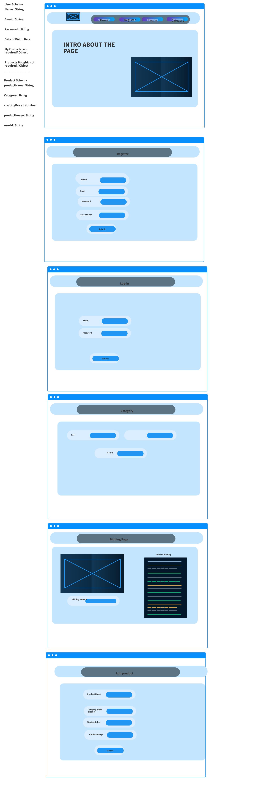

## TEAM MEMBERS: 
 
Ghofran Dayyat
 
Mohammad Azzam
 
Nihad Zeidan
 
Zakeyah Abu-Yassen
 
 
## Summary of first idea.
 
Bid Fast and Last (BFAL), Auction application to buy and sell products.

## What problem or pain point does it solve? a. Keep it high level without going into too much detail. (3-4 sentences is enough).
 
Make auction process easier and more accessible, by providing real-time auction web-application. Allow users not only to buy products but to be able also to sell products.

## Minimum Viable Product (MVP) definition.
      What is the minimum required for you to present on your demo day?
 

  -	Register and sign-in page
  -	Choosing product page 
  -	Form to offer products to sell
  -	Authentication and O-Auth
  -	Allow chatting in the bidding session (stretch goal)
  -	Network – page to see all announcement happening on the page (stretch goal)
  

## Heroku Deployment:
[Bid Fast And Last](https://bid-fast-and-last.herokuapp.com/)

  - Register and sign-in page
  - Choosing product page
  - Form to offer products to sell
  - Authentication and O-Auth
  - Allow chatting in the bidding session (stretch goal)
  - Network – page to see all announcement happening on the page (stretch goal)

 

